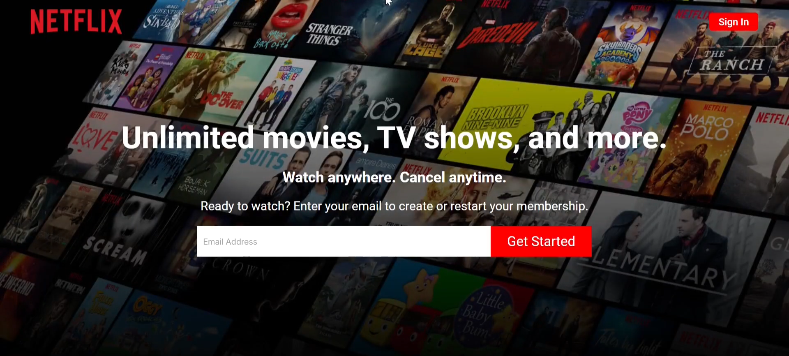
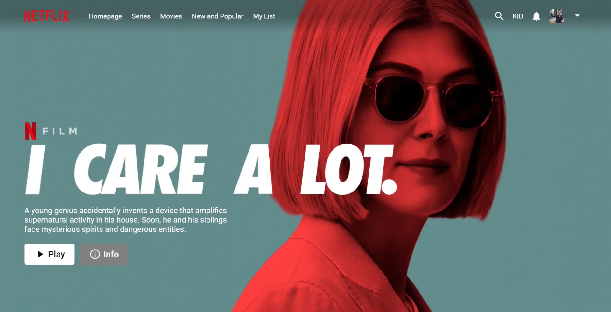
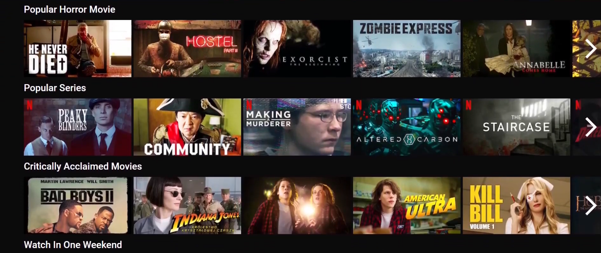

# Movie Streaming Platform

A full stack movie streaming platform built with React, Node.js, and MongoDB. The application allows users to browse and watch movies, manage profiles, and perform admin operations. It features JWT authentication, React Hooks, and Context API for state management.

---

## Project Images







---

## Technologies

```React.js```  ```Node.js```  ```Express.js```  ```MongoDB```  

---

## Features

- Node.js and Express backend for API routes, user authentication, and movie CRUD operations  
- MongoDB database storing users, movies, and lists securely  
- JWT-based authentication with protected routes  
- React frontend using Hooks and Context API for state and global data management  
- Dynamic movie listings with categories and featured movies  
- Movie detail pages with streaming-like functionality  
- Admin panel with dashboard for managing movies, users, and statistics  
- Charts and analytics in the admin dashboard  
- File uploads for movie images and trailers via Firebase  
- Fully responsive design for desktop and mobile  
- Error handling for API requests, user inputs, and edge cases  

---

## Running the Project

1. Clone the repository:
   ```bash
   git clone https://github.com/ssharpalla2002/Movie_Streaming_Platform.git
   ```

2. Install backend dependencies and run the server:
   ```bash
   cd api
   npm install
   npm run dev
   ```

3. Install frontend dependencies and run the client:
   ```bash
   cd client
   npm install
   npm start
   ```

4. Open the application in your browser:
   ```
   http://localhost:3000
   ```

